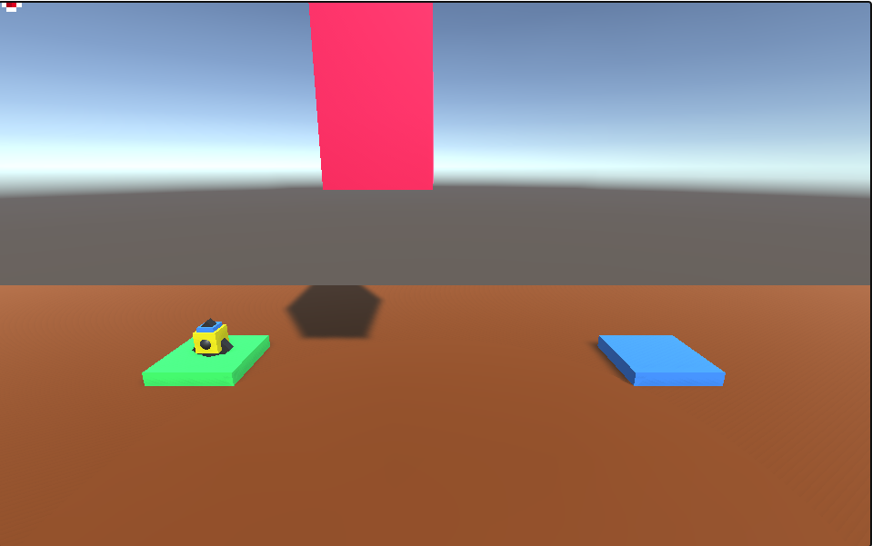

# Unity_Project_Alpha
Alpha version of the project for TUD

This game is designed for TuD as [Alpha Project](https://denysrudenko.github.io/Unity_Project_Alpha/).

## Introduction
**Galactic Rocket Adventure** is a interstellar journey Unity game. Pilot a powerful rocket through a vast galaxy, overcoming dynamic obstacles to reach the ultimate destination - a mesmerizing blue box that marks your triumph.

# Table of Contents
- [1. Who will be interested in playing this game?](#interested)
    - [User Experience:](#user-exp)
    - [User Goals:](#user-goals)
    - [User Expectations:](#user-expectations)
    -	[Audio](#audio)
    - [Particles](#prefabs)
    - [Objects](#objects)
    - [Levels](#levels)
    - [Images](#images)
- [2.Game Features](#gamefeatures)
    - [Movement script](#Movement)
    - [CollisionHandler script](#collision)
    - [Health](#health)
- [3.Technologies used](#technologies-used)
- [4.Bugs](#bugs)
- [6. GitHub](#git)
- [7. Information](#acknowledgement)
- [8. Future](#future)

  

# 1. Who will be interested in playing this game??
  [Go to the top](#table-of-contents)
* Space Enthusiasts: Individuals with a fascination for space exploration and the cosmos may be drawn to the immersive galactic setting of your game. 
* Arcade Game Fans will get feel with quick and engaging gameplay, it could attract those who enjoy classic arcade games.

## 1.1 User experience 
   [Go to the top](#table-of-contents)

Ensuring a positive user experience (UX) is crucial for the success of any game.

## 1.2 User Goals
  [Go to the top](#table-of-contents)

My main goal is creating a fun and entertaining game experience for players who enjoy space-themed adventures and challenging gameplay.

## 1.3 User Expectations
   [Go to the top](#table-of-contents)

The main user Expectations:
* Intuitive Controls.
* Visual Appeal.
* Engaging Sound Effects and Music.
* Progressive Difficulty.

## 1.4 Audio
  [Go to the top](#table-of-contents)

In our Unity game, cool space music kicks in the moment your mission begins. 

## 1.5 Prefabs
  [Go to the top](#table-of-contents)

There is a 3 main prefabs at that moment:
* Explosion
* Success
* Engine

What did we do?
* Created an explosion when game object hits the obstacle.
* Created an success explosion when object landing at blue box.
* Created an engine thrust when rocket flying.

## 1.6 Objects
  [Go to the top](#table-of-contents)

There is a 4 main objects at that moment:
* Rocket
* Launch box
* Landing box
* Obstacle

## Levels

At that moment there is 3 levels.

### Images
   [Go to the top](#table-of-contents)

* Hearths icons

  

# 2. Features
  [Go to the top](#table-of-contents)

### Movement script

#### ProcessThrust()

This method developed for rocket that helps user to control it. To control the rocket user should press "Space" button. Also there is included if statements for rocket sound and rocked particle.

#### ProcessRotation()

This method developed to help user to control rocket left and right, the buttons set to "A" and "D". Also included if statements for left particle and right particle.

#### ApplyRotation()

Freezing and unfreezing rotation is a technique used to prevent conflicts between manual and physics-based rotations.

### Collision Handler script

#### OnCollisionEnter()

This method developed for our playing object to to trigger with other elements in the game. Such as: obstacles, starting position, ending position, fuel objects. Everything developed in the switch statement. The tags are: "Friendly", "Finish", "Fuel" and default.

#### HearthLoss()

In this method we implement the functionality for health, this method trigger the other method from Health script for taking damage. There is if statement that checks our health, if health is 0, we start StartCrashSequence() method.

#### StartCrashSequence()

This method developed for crash situation for rocket object and also reaload the level to the starting position. The audio source for playing rocket thurster stops and crash particle appear.

#### StartSuccessSequence()

This method developed for success situation for rocket object and also start new level. The audio source for playing rocket thurster stops and success particle appear.

#### ReloadLevel()

This method stand for reloading the scene. We load our scene through the index.

#### LoadNextLevel()

To load next level we adding 1 to the current index.

#### DisableGameObject()

This method is for disable the game object. Its not implemented yet.

### Health script

#### TakeDamage()

In this method we implemented damage. Also we included the check for health that doesnt go below 0.

#### UpdateHearts()

In this method we updating the health-hearts status, using following methods: ClampMaxHealth(), UpdateHeartSprites(), DisplayHearts().

#### UpdateHeartSprites()

In this method we updating the hearth images using for counter. Using the Length of hearts list. Including full hearts and empty Hearts.

#### DisplayHearts()

In this method we sowing the number of hearts we have. At the start of the script we have a variable "numOfHearts". The max number of hearts could be 3. If we want to include 10 hearts for example, we shoul update the images in Canvas.

### General Information

#### Rocket Launcher Experience:

Command a rocket with precision through a visually stunning galactic landscape.

#### Health Management:

Navigate wisely! You have three health bars, and each collision with obstacles inflicts one damage. Can you strategically navigate to preserve your health and conquer the challenges?

#### Dynamic Obstacles:

Face moving obstacles that add an extra layer of excitement and challenge to your cosmic adventure.

#### Objective:

Your primary mission is to successfully navigate the map, avoiding damage and ultimately steering your rocket into the coveted blue box.

#### Instructions:

* Launch the game and take control of the rocket.
* Navigate through the galaxy, avoiding obstacles to preserve your health.
* Reach the blue box to complete the level and achieve victory.

# 3. Technologies Used
  [Go to the top](#table-of-contents)

* [Unity](https://unity.com/) is a widely used cross-platform game development engine.

* [Unity Store](https://assetstore.unity.com/) is an online marketplace provided by Unity Technologies.

* [C Sharp](https://en.wikipedia.org/wiki/C_Sharp_(programming_language)) is a modern, versatile, and object-oriented programming language developed by Microsoft.

* [Free Sound](https://freesound.org/) was used to download audio for the game.

* [Github](https://github.com/) was used to create the repository and to store the project's code after pushed from Git.

* [Visual Studio](https://code.visualstudio.com/) was used as code generator. I installed ssh for comfortable work.

# 4. Testing
  [Go to the top](#table-of-contents)

# 5. Bugs
 [Go to the top](#table-of-contents)

* Background music starting to play over again at the next stage of the game. Will be fixed in 1.0 Version.

  ### Solved bugs

* There was a problem with heart images for health indicator, to fix it I rotated 3 images in order to display 3 hearts, and then created a list in C Sharp script.
* I had a bug with a particle sound, the audio were playing in loop, to fix it I used PlayOneShot(soundExample) and if statement.

### Manual Testing

- General

| Feature                | Outcome                                                 | Pass/Fail|
|:----------------------:|:-------------------------------------------------------:| ---      |
| Background Sound       | Background sound working as expected                    | Pass     |
| Next Level Loading     | Next level loads as expected                            | Pass     |
| Particles              | Particles animation work as expected                    | Pass     |
| Health animation       | Health animaton working as expected                     | Pass     |
| Object falling         | Player object fall down if trigger the obstacle         | Pass     |

   
- Object Section

Feature | Outcome | Pass/Fail
--- | --- | ---
Rocket | Flying in X, Y rotation, works as expected | Pass
Obstacle | Deals damage to player object, work as expected. | Pass
Landing box | Jump over to next level, works as expected  | Pass
Launch box  | No hurt to player object, works as expected. | Pass

[Go to the top](#table-of-contents)

 
# 6. GitHub
  [Go to the top](#table-of-contents)

Game was deployed to GitHub pages in GH-PAGES branch:
- Sharing of mine repository here - https://github.com/DenysRudenko/Unity_Project_Alpha
- The live link can be found here - (https://denysrudenko.github.io/Unity_Project_Alpha/)

  
# 7. Information
 [Go to the top](#table-of-contents)

### Reference
* Link for audio that working with rocket(rocket boost) https://freesound.org/people/qubodup/sounds/146770/

* Retro background music https://freesound.org/people/sonically_sound/sounds/624874/

* Heart youtube tutorial that helped to implevement the health functionality https://www.youtube.com/watch?v=BLfNP4Sc_iA&t=12s

# 8. Future
[Go to the top](#table-of-contents)

### Feul Bar
* Develop the fuel bar for rocket(timer/button pressing).

### Levels
* Develop more levels with different difficulty.

### Obstacles
* Create a movement script for obstacles, so the game will be much harder.

### Fuel Pick Up
* Create a fuel pick up functionality.

### Lights Feuture
* Create more lights in level to make level become more nicer.

### Menu
* Create a menu for game with buttons, such as: "New Game", "Quit Game", "Shop".

### Main Menu Scene
* Create a menu scene background, would be nice if its gonna be animated.

### Implement Sounds
* Implement more sounds and create a more immersive audio experience.
